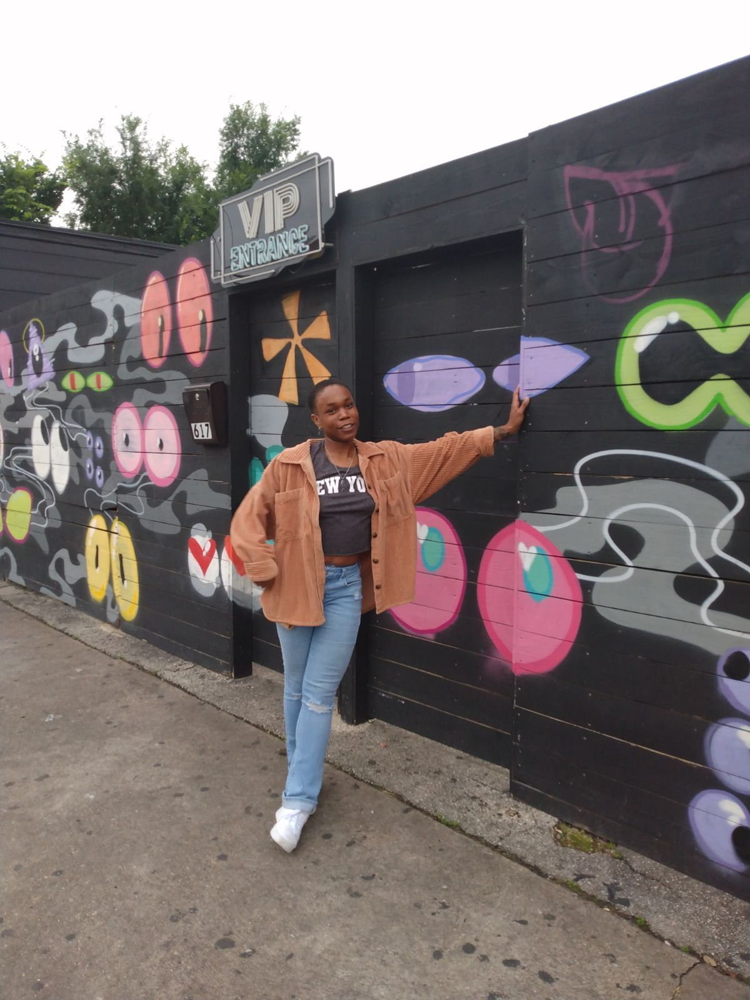

# Hello and Welcome! 😊

This is my personal portfolio. Below you can explore my background, research, and experience.
[Link to another page](./another-page.html).

---

## About Me 🔎

  

Thank you for visiting my portfolio page! My name is Lois Randolph and I was born and raised in San Antonio, Texas. I attended the University of Texas at San Antonio where I received my B.S. in Biology with a minor in Mathematics. I spent a gap year as a PREP (Postbaccalaureate Research Education Program) scholar at the University of Texas Health Science Center San Antonio, successfully finishing the year-long rigorous program that prepared me for graduate school. After completing my post-bac program, I was later accepted into the UT Health SA Graduate School of Biomedical Sciences where I earned my M.S. in Cancer Biology. During my time in graduate school, I served as the Advocacy Chair for UTHSCSA PRIDE and vice president for ALLIES, volunteering at clinical events that raise awareness to queer youth having access to healthcare, mental health resources, educational development programs, and hosting multiple student-led social events.

I'm a biologist by training but a programmer at heart, with a deep passion for precision medicine, computational biology, data science, machine learning, AI, and data engineering. I'm primarily self-taught in R, Python, SQL, HTML, CSS and Linux. I enjoy the challenges presented to me that involve, building prediction models to identify biomarkers to improve medical treatments, manage tools & databases used by teams, institutions, and companies for data storage, data processing, and quality control, and developing pipelines that can automate tasks improving work efficiency. Though this is a different career path I was not expecting, I believe that "where there is passion and inspiration, you can't go wrong".

---

### Education 🎓

| Degree | Institution | Year |
|:-------------|:------------------|:------|
| M.S. in Cancer Biology | University of Texas Health Science Center San Antonio | 2023 |
| B.S. in Biology, Minor in Mathematics | University of Texas at San Antonio | 2020 |

---

## Experience

### Bioinformatics Researcher
**UT Health Science Center · Dec. 2023–Present**

- Lead the development of early diagnostic and prognostic models for neonatal and pediatric care to identify risk of disease onset and clinical outcomes.  
- Integrated heterogeneous datasets including EMR, bulk RNA-seq, single-cell RNA-seq, spatial transcriptomics, methylation, microbiome, proteomics, and other omics or clinical data.  
- Developed and applied statistical models ranging from simple linear regressions to mixed-effects frameworks on both static and longitudinal datasets, rigorously controlling for covariates and batch effects.  
- Engineered reproducible, containerized workflows leveraging parallel processing to optimize data handling, multicohort meta-analyses, and regression and classification tasks, improving computational efficiency ~50% and enabling systematic model comparison.
- Designed unsupervised machine learning workflows to identify patient subgroups across diverse datasets.  
- Refined single-cell type annotations and integrated single-cell with spatial transcriptomics for high-resolution tissue maps.  
- Implemented version-controlled workflows using Git to ensure reproducibility and collaboration.  
- Supported clinical decision-making by translating complex molecular and clinical data into actionable insights for risk assessment and patient stratification.
- Reviewed research grants for completeness, methodological rigor, and data integrity; conducted exploratory analyses to identify errors and gaps prior to submission.

### Graduate Research Assistant
**UT Health Science Center · Aug. 2021– Dec. 2023**

- Performed end-to-end processing of raw bulk RNA-seq FASTQ data, including quality assessment, adapter and low-quality base trimming, alignment to mouse (mm9) and human reference genomes, and generation of gene-level expresssion count matrices for downstream analysis.
- Processed raw single-cell RNA-seq data from FASTQ files to gene-by-cell expression matrices, including demultiplexing, barcode and UMI processing, quality control, read alignment to reference genomes or transcriptomes, and feature count matrix generation. 
- Conducted differential expression analysis on 12 triple-negative breast cancer (TNBC) xenograft and syngeneic mice models, uncovering suppression of oncogenic signaling pathways in high-fat diet (HFD) groups treated with the small-molecule compound EC359.

### Intern
**Baylor College of Medicine | Human Genome Sequencing Center · June 2021 - Aug. 2021**

- Linked and organized data from over 10 entity types, including Allele Molecular Consequence, Variant, and Population Allele Frequency enhancing the curation process for ClinGen.
- Maintained and updated the LDH, ensuring availability of 1+ million data points in a highly accessible format for researchers and curators.
- Translated 1000+ lines of Ruby code into JavaScript, enabling smooth data parsing and interaction with APIs across multiple domains.
- Developed and optimized data pipelines to transform and aggregate gene and variant information, improving the efficiency of data retrieval and supporting 500+ ClinGen curation projects.

### PREP Scholar
**UT Health Science Center · June 2020 - June 2021**

- Designed custom code from ImageJ-processed microscopy images to identify regions of interest capturing colocalized proteins for 100+ images, analyzing two color channels to pinpoint and quantify protein interactions.
- Applied image processing tools in Python to enhance microscopy images, improving quality and contrast, identifying samples, annotating labels, and tailoring visuals for professional reporting.
- Employed an automated colocalization analysis on microscopy images, applying Mander's colocalization coefficient to identify and quantify 100+ colocalized regions of the proteins CTD, SRSF2, and EWS across various experimental conditions, revealing significant interaction between these proteins.

---

### Fun Facts 💫

* your friendly neighborhood bioinformatician 🖥️  
* Avid Rollerblader 🛼  
* Rubik's Cube Enthusiast 🤓  
* Unapologetically an anime fanatic 🥷  
* Probably dancing while you're reading this 💃🏾  

---

## Contact Me 

<section id="contact-me" style="text-align:center; margin-top:2rem;">
  

    <a href="mailto:lois.randolph@outlook.com" style="display:flex; align-items:center; gap:5px; text-decoration:none;">
       Email
    </a>
    <a href="https://www.linkedin.com/in/lois-randolph" target="_blank" style="display:flex; align-items:center; gap:5px; text-decoration:none;">
       LinkedIn
    </a>
    <a href="https://github.com/Low-is" target="_blank" style="display:flex; align-items:center; gap:5px; text-decoration:none;">
       GitHub
    </a>
  

</section>

---
