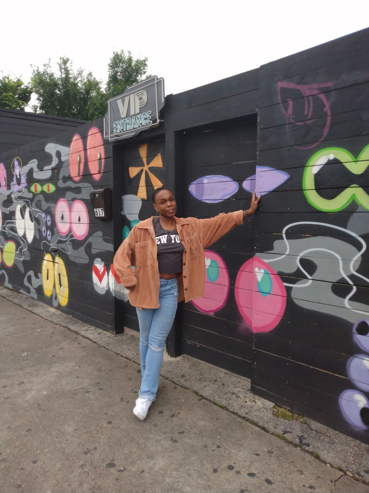

<!-- Top tabs below the site title/description -->
<!-- Tab Bar -->

  <!-- Left spacer so first tab is not cut off -->
  

  <a href="{{ '/projects.html' | relative_url }}" style="
    flex: 0 0 auto;
    display: inline-flex;
    align-items: center;
    padding: 0.5rem 0.75rem;
    font-size: 0.95rem;
    font-weight: 600;
    color: #007acc;
    text-decoration: none;
    border: 1px solid #007acc;
    border-bottom: none;
    border-radius: 4px 4px 0 0;
    white-space: nowrap;
    text-align: center;
  ">Projects </a>
  

  <a href="{{ '/guides.html' | relative_url }}" style="
    flex: 0 0 auto;
    display: inline-flex;
    align-items: center;
    padding: 0.5rem 0.75rem;
    font-size: 0.95rem;
    font-weight: 600;
    color: #007acc;
    text-decoration: none;
    border: 1px solid #007acc;
    border-bottom: none;
    border-radius: 4px 4px 0 0;
    white-space: nowrap;
    text-align: center;
  ">Helpful Guides 🤓 (Under Construction 🚧)</a>
  

  <a href="#clinical" style="
    flex: 0 0 auto;
    display: inline-flex;
    align-items: center;
    padding: 0.5rem 0.75rem;
    font-size: 0.95rem;
    font-weight: 600;
    color: #007acc;
    text-decoration: none;
    border: 1px solid #007acc;
    border-bottom: none;
    border-radius: 4px 4px 0 0;
    white-space: nowrap;
    text-align: center;
  ">Clinical Informatics (Under Construction 🚧)</a>

  <!-- Right spacer so last tab is not cut off -->
  

# 👋 Hello and Welcome! 😊

## Personal Portfolio

This is my personal portfolio. Below you can explore my background, research and self-guided projects, and experience. 

---

## About Me 🔎

  

Thank you for visiting my portfolio. My name is **Lois Randolph**, and I am a bioinformatician with a background in biology and a strong focus on computational and data-driven approaches to biomedical research. I was born and raised in San Antonio, Texas, and earned my **B.S. in Biology with a minor in Mathematics** from the University of Texas at San Antonio.

Following my undergraduate training, I completed a **Postbacclaureate Research Education Program (PREP)** at the University of Texas Health Science Center at San Antonio, where I gained intensive research experience and preparation for graduate school. I than earned my **M.S. in Cancer Biology** from the UT Health San Antonio Graduate School of Biomedical Sciences.

Although I am a biologist by training, I am a programmer at heart, with a strong passion for **precision medicine**, **computational biology**, **data science**, **machine learning**, **AI**, and **data engineering**. I am largely self-taugh in **Python**, **SQL**, **Linux**, and **web development tools**. I enjoy building predictive models for biomarker discovery, developing automated and reproducible data pipelines, and managing tools and databases that support data storage, processing, and quality control at scale. 

---

### Education 🎓

| Degree | Institution | Year |
|:-------------|:------------------|:------|
| M.S. in Cancer Biology | University of Texas Health Science Center San Antonio | 2023 |
| B.S. in Biology, Minor in Mathematics | University of Texas at San Antonio | 2020 |

---

## Skills
### Programming Languages
 

### Machine Learning

### Deep Learning

### Data Engineering & Databases

### Worflow & Reproducibility

## Experience

### Bioinformatics Researcher
**UT Health Science Center | Pediatrics · Dec. 2023–Present**

- Lead the development of early diagnostic and prognostic models for neonatal and pediatric care to identify risk of disease onset and clinical outcomes.  
- Integrated heterogeneous datasets including EMR, bulk RNA-seq, single-cell RNA-seq, spatial transcriptomics, methylation, microbiome, proteomics, and other omics or clinical data.  
- Developed and applied statistical models ranging from simple linear regressions to mixed-effects frameworks on both static and longitudinal datasets, rigorously controlling for covariates and batch effects.  
- Reproducible, containerized workflows that leverage parallel processing optimizing data handling, harmonization, multicohort meta-analyses, and regression and classification tasks.
- Unsupervised machine learning (exploratory analyses) and supervised machine learning.  
- Refined single-cell type annotations and integrated single-cell with spatial transcriptomics mapping predicted cell types to lung spatial landscape.  
- Version control using Git.  
- Supported clinical decision-making by translating complex molecular and clinical data into actionable insights for risk assessment and patient stratification.
- Review research grants for methodological rigor and data integrity; conducted exploratory analyses to identify errors and gaps prior to submission.

### Graduate Research Assistant
**UT Health Science Center | Integrated Biomedical Sciences · Aug. 2021– Dec. 2023**

- Processed raw bulk RNA-seq FASTQ files; quality assessment, trimming, alignment to mouse (mm9) and human 
reference genomes, and generation of gene-level expression count matrices.
- Processed raw single-cell RNA-seq FASTQ files to gene-by-cell expression matrices; demultiplexing, barcode and 
UMI processing, quality control, read alignment to reference genomes or transcriptomes, and feature count matrix 
generation.
- Computational analysis of EC359 treatment response across TNBC, inflammatory breast cancer (IBC), and Type II 
endometrial cancer (ECa) models (e.g., in vitro, xenograft, and PD-xenograft models).
- Performed transcriptomic profiling and differential expression modeling to characterize the effects of LIFR 
inhibition in biological pathways.
- Analyzed and quantified drug efficacy (t-test, one- and two-way ANOVA), treatment-response stratification, and 
immunohistochemistry images. 

### Intern
**Baylor College of Medicine | Human Genome Sequencing Center · June 2021 - Aug. 2021**

- Linked and organized data from over 10 entity types, including Allele Molecular Consequence, Variant, and Population Allele Frequency enhancing the curation process for ClinGen.
- Maintained and updated the LDH, ensuring availability of 1+ million data points in a highly accessible format for researchers and curators.
- Translated 1000+ lines of Ruby code into JavaScript, enabling smooth data parsing and interaction with APIs across multiple domains.
- Developed and optimized data pipelines to transform and aggregate gene and variant information, improving the efficiency of data retrieval and supporting 500+ ClinGen curation projects.

### PREP Scholar
**UT Health Science Center | Biochemical Mechanisms in Medicine · June 2020 - June 2021**

- Designed custom code from ImageJ-processed microscopy images to identify regions of interest capturing colocalized proteins for 100+ images, analyzing multi color channels to pinpoint and quantify protein interactions.
- Image processing with Python tools to enhance microscopy images, improving quality and contrast, identifying samples, annotating labels, and tailoring visuals for professional reporting.

---

### Fun Facts 💫

* Your friendly neighborhood bioinformatician 🖥️  
* Avid Rollerblader 🛼  
* Rubik's Cube Enthusiast 🤓  
* Unapologetically an anime fanatic 🥷  
* Probably dancing while you're reading this 💃🏾  

---

## Connect with me 

<section id="contact-me" style="text-align:center; margin-top:2rem;">
  

    <a href="mailto:lois.randolph@outlook.com" style="display:flex; align-items:center; gap:5px; text-decoration:none;">
       Email
    </a>
    <a href="https://www.linkedin.com/in/lois-randolph" target="_blank" style="display:flex; align-items:center; gap:5px; text-decoration:none;">
       LinkedIn
    </a>
    <a href="https://github.com/Low-is" target="_blank" style="display:flex; align-items:center; gap:5px; text-decoration:none;">
       GitHub
    </a>
  

</section>

---
